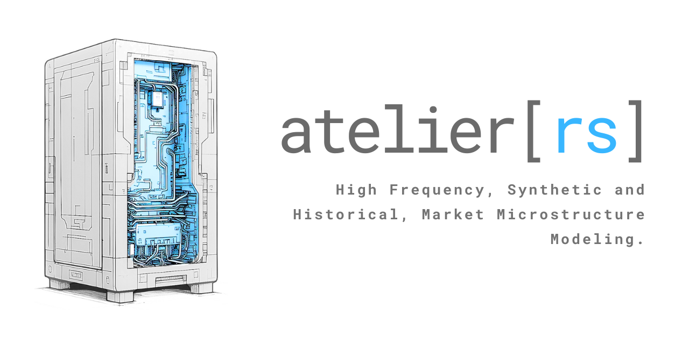

# atelier



[![Crates.io][badge-crates]][url-crates]
[![Apache-V2 licensed][badge-license]][url-license]

[badge-crates]: https://img.shields.io/crates/v/atelier.svg
[url-crates]: https://crates.io/crates/atelier

[badge-license]: https://img.shields.io/badge/license-apachev2-blue.svg
[url-license]: https://github.com/iteralabs/atelier/blob/develop/LICENSE

An engine for High Frequency, Synthetic and Historical, Market Microstructure Modeling.

# Overview

At a high level it provides the following major components: 

- Limit orderbook completeness with order-level specificity (Not only price and volume but actual order queues).
- Stochastic process generators for rich/complex simulations (Brownian, Hawkes, etc).

# Use

## Docker (recommended)

```shell
docker build \
    --platform linux/amd64 \
    --target runner \
    --file .Dockerfile \
    --tag atelier-torch \
    --no-cache . 
```

# Roadmap

1. Async Backtesting Engine with computational and financial metrics.
2. Order-Driven streaming tools for a Pub/Sub pattern.
3. Async Matching Engine with FIFO logic.

# License

This project is licensed under the Apache V2 license. Any contribution intentionally submitted for inclussion in Atelier by you, shall be licensed as Apache V2, without any additional terms or conditions. 
