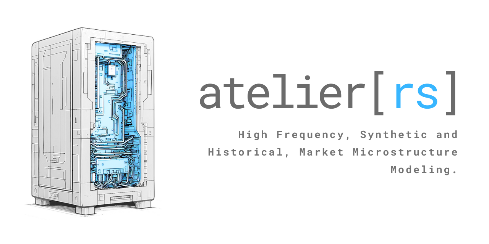

# atelier

[![Crates.io][badge-crates]][url-crates]
[![Apache-V2 licensed][badge-license]][url-license]

[badge-crates]: https://img.shields.io/crates/v/atelier.svg
[url-crates]: https://crates.io/crates/atelier

[badge-license]: https://img.shields.io/badge/license-apachev2-blue.svg
[url-license]: https://github.com/iteralabs/atelier/blob/develop/LICENSE

## Overview

Use `atelier` for modeling market microstructure dynamics, it supports an `orderbook-based` market structure. Whether you need a high quality reproduction of any given market within a defined period of time (market replay), or, to generate `what-if` scnearios either completely random, or, with model specification (market simulation). 

## Contribute

Feel free to contribute, just make sure you check the [CONTRIBUTING]() guidelines. Also consider to pick-up the existing [issues]().
