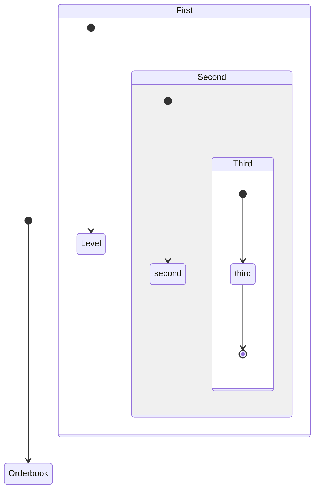

# Limit Order Book Basic Methods

## Random creation

A Limit Order Book is the most basic data structure there is in an order-driven market. 

```rust
use atelier::data:market::Orderbook;

fn main() {
    let random_ob = Orderbook::random();
    println!("{:?}", random_ob);
}
```

## General 

- Orderbook Structure: Orderbook < Level, Level, ..., Level >
- Level Structure: Level < Order, Order , ..., Order >
- Order Structure: Order < s_l_order > 


optimizacion distribuida para aprendizaje distribuido: Teoricamente seria IDEAL sacar resultados

Simulador es para generar un subconjunto de datos para usarse con un proposito particular:



